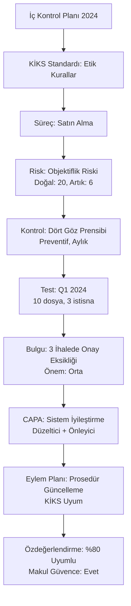

# İÇ KONTROL MODÜLÜ - ENTEGRASYON REHBERİ VE ÖRNEK VERİLER

Bu dokümanda iç kontrol modülündeki tüm sayfaların nasıl çalıştığı ve birbirine nasıl entegre olduğu anlatılmaktadır.

---

## 📋 MODÜL SAYFALARI VE AMAÇLARI

### 1. **İç Kontrol Planları** (`/internal-control-plans`)
**Amaç:** Tüm iç kontrol çalışmalarının başlangıç noktası
**Tablo:** `ic_plans`
**Örnek:** "2024 Yılı İç Kontrol Planı"

**Ne İşe Yarar:**
- Her yıl için ayrı bir iç kontrol planı oluşturulur
- Tüm KİKS standartları, süreçler, riskler bir plana bağlıdır
- Plan aktif/pasif duruma getirilebilir

---

### 2. **KİKS Standartları Yönetimi** (`/kiks-standards`)
**Amaç:** Kamu İç Kontrol Standartları hiyerarşisinin yönetimi
**Tablolar:** `ic_kiks_categories` → `ic_kiks_main_standards` → `ic_kiks_sub_standards`

**3 Seviyeli Yapı:**
```
📁 KİKS Kategorisi (5 Bileşen)
  ├── 📂 Ana Standart
  │     ├── 📄 Alt Standart 1
  │     ├── 📄 Alt Standart 2
  │     └── 📄 Alt Standart 3
```

**Örnek Hiyerarşi:**
```
1. KONTROL ORTAMI (Kategori)
   └── 1.1 Etik Değerler ve Dürüstlük (Ana Standart)
        └── 1.1.1 Etik Kurallar ve Davranış Kuralları (Alt Standart)
        └── 1.1.2 Yönetim Anlayışı ve İşleyiş Tarzı (Alt Standart)

2. RİSK DEĞERLENDİRME (Kategori)
   └── 2.1 Risk Yönetimi Stratejisi (Ana Standart)
        └── 2.1.1 Kurumsal Risk Yönetim Planı (Alt Standart)

3. KONTROL FAALİYETLERİ (Kategori)
4. BİLGİ VE İLETİŞİM (Kategori)
5. İZLEME (Kategori)
```

---

### 3. **Süreç Yönetimi** (`/process-management`)
**Amaç:** Kurumun iş süreçlerinin tanımlanması ve yönetimi
**Tablolar:** `ic_processes` → `ic_process_steps`

**Ne İşe Yarar:**
- Her süreç bir iş akışını tanımlar (Satın Alma, Personel İşleri, Muhasebe vb.)
- Her süreç, adım adım tanımlanır
- Süreçler KİKS standartlarına bağlanabilir
- Süreçler üzerindeki riskler tanımlanır

**Örnek Süreç: "Satın Alma ve İhale Süreci"**
```
Kod: SRC-2024-001
Kategori: Mali
KİKS Bağlantısı: KO.01.01 (Etik Kurallar)

Adımlar:
1. İhtiyaç Tespiti → 2. Talep Onayı (KKN*) → 3. Bütçe Kontrolü (KKN*)
→ 4. İhale Hazırlık → 5. İhale Komisyonu Değerlendirme (KKN*)
→ 6. Sözleşme İmzalama → 7. Muayene ve Kabul (KKN*)

*KKN: Kritik Kontrol Noktası
```

**Süreç Akış Diyagramı:** Sistem, süreç adımlarından otomatik akış diyagramı oluşturur

---

### 4. **Risk Yönetimi** (`/risk-management`)
**Amaç:** Süreçlerdeki risklerin tanımlanması ve değerlendirilmesi
**Tablo:** `ic_risks`

**Risk Değerlendirme Modeli:**
```
Doğal Risk (Inherent Risk)
├── Olasılık (1-5): Riskin gerçekleşme ihtimali
├── Etki (1-5): Gerçekleşirse kuruma etkisi
└── Skor = Olasılık × Etki (max 25)

Artık Risk (Residual Risk)
├── Kontroller uygulandıktan sonra kalan risk
└── Skor = Olasılık × Etki (max 25)

Risk Azalması = Doğal Risk - Artık Risk
```

**Örnek Risk:**
```
Kod: RSK-2024-001
Süreç: Satın Alma ve İhale Süreci
Başlık: Tedarikçi Seçiminde Objektiflik Riski

Doğal Risk:
- Olasılık: 5 (Çok Yüksek)
- Etki: 4 (Yüksek)
- Skor: 20 (KRİTİK)

Artık Risk (Kontrol Sonrası):
- Olasılık: 2 (Düşük)
- Etki: 3 (Orta)
- Skor: 6 (DÜŞÜK)

Risk Azalması: 14 puan (70% azalma)
```

**Risk Kategorileri:**
- Stratejik: Kurumun stratejik hedeflerine yönelik riskler
- Operasyonel: Günlük işleyişle ilgili riskler
- Finansal: Mali kaynaklarla ilgili riskler
- Uyumluluk: Mevzuata uyum riskleri
- İtibar: Kurumun itibarını etkileyen riskler

---

### 5. **Kontrol Faaliyetleri** (`/control-activities`)
**Amaç:** Riskleri azaltmak için kontrollerin tanımlanması
**Tablo:** `ic_controls`

**Kontrol Türleri:**
- **Önleyici (Preventive):** Riskin oluşmasını engeller
- **Tespit Edici (Detective):** Oluşan riskleri tespit eder
- **Düzeltici (Corrective):** Oluşan zararı azaltır

**Kontrol Özellikleri:**
- **Doğası:** Manuel / Otomatik / Yarı-Otomatik
- **Sıklığı:** Sürekli / Günlük / Haftalık / Aylık / Çeyreklik / Yıllık
- **Etkinlik:** Tasarım Etkinliği / Operasyonel Etkinlik

**Örnek Kontrol:**
```
Kod: KTR-2024-001
Risk: RSK-2024-001 (Tedarikçi Seçiminde Objektiflik)
Başlık: Dört Göz Prensibi Uygulaması

Açıklama:
Tüm ihale değerlendirmelerinde en az 2 yetkili personelin onayı alınır.
Tek kişi karar alamaz, çapraz kontrol sağlanır.

Özellikler:
- Tür: Önleyici
- Doğa: Manuel
- Sıklık: Aylık
- Tasarım Etkinliği: Etkili
- Operasyonel Etkinlik: Etkili

Kanıt:
- İmzalı değerlendirme formları
- Komisyon tutanakları
- Onay evrakları
```

---

### 6. **İzleme & Değerlendirme** (`/monitoring-evaluation`)
**Amaç:** Kontrollerin test edilmesi ve etkinliğinin ölçülmesi
**Tablo:** `ic_control_tests`

**Test Süreci:**
```
1. Test Dönemi Belirleme (örn: Q1 2024)
2. Örneklem Seçme (örn: 10 ihale dosyası)
3. Test Yapma
4. İstisnaları Kaydetme
5. Sonuç Belirleme
6. Kanıt Toplama
```

**Test Sonuçları:**
- ✅ **Başarılı (Pass):** Tüm örneklem kontrol gereksinimlerini karşılıyor
- ⚠️ **İstisnalarla Başarılı (Pass with Exceptions):** Kontrol çalışıyor ama bazı eksiklikler var
- ❌ **Başarısız (Fail):** Kontrol etkili çalışmıyor
- ➖ **Uygulanmaz (Not Applicable):** Bu dönem için kontrol gerekli değil

**Örnek Test:**
```
Kontrol: KTR-2024-001 (Dört Göz Prensibi)
Test Dönemi: 1 Ocak 2024 - 31 Mart 2024
Test Tarihi: 15 Nisan 2024
Test Eden: Ali Yılmaz

Örneklem: 10 ihale dosyası seçildi
Bulunan İstisnalar: 3 dosyada ikinci onay eksik

Sonuç: ⚠️ İstisnalarla Başarılı

Not:
10 ihaleden 3 tanesinde (IHL-2024-012, IHL-2024-018, IHL-2024-023)
değerlendirme formlarında ikinci onay eksik. Kontrol genel olarak
etkin ama bu eksiklikler giderilmeli.

Kanıt Dosyaları:
- test_raporu_q1_2024.pdf
- ihale_dosyalari_orneklem.xlsx
- fotograf_eksik_formlar.jpg
```

---

### 7. **Bulgu Yönetimi** (CAPA Management sayfasında)
**Amaç:** Testlerden ve denetimlerden çıkan bulguların yönetimi
**Tablo:** `ic_findings`

**Bulgu Kaynakları:**
- İç Denetim
- Dış Denetim (Sayıştay)
- Kontrol Testi
- Özdeğerlendirme
- Yönetim İncelemesi

**Örnek Bulgu:**
```
Kod: BLG-2024-001
Kaynak: Kontrol Testi (Test ID: Q1 2024)
Başlık: 3 İhalede Değerlendirme Formlarında İkinci Onay Eksikliği

Açıklama:
Q1 2024 kontrol testinde 10 ihale dosyasından 3 tanesinde
değerlendirme formlarının sadece bir yetkili tarafından onaylandığı,
dört göz prensibinin uygulanmadığı tespit edildi.

İhaleler:
- IHL-2024-012 (50.000 TL)
- IHL-2024-018 (120.000 TL)
- IHL-2024-023 (85.000 TL)

Önem Derecesi: Orta
Durum: Açık

Kök Neden Analizi:
1. İhale yoğunluğu artmış, ikinci onaylayıcılar yetişemiyor
2. İş yükü dengesiz dağılmış
3. Yedek onaylayıcı mekanizması yok
```

---

### 8. **CAPA Yönetimi** (`/capa-management`)
**Amaç:** Düzeltici ve Önleyici Faaliyetlerin (DÖF) yönetimi
**Tablolar:** `ic_capas` → `ic_capa_actions`

**CAPA = Corrective and Preventive Actions (Düzeltici ve Önleyici Faaliyetler)**

**CAPA Türleri:**
- **Düzeltici (Corrective):** Oluşmuş sorunu düzeltir
- **Önleyici (Preventive):** Gelecekte oluşmasını engeller
- **İkisi de (Both):** Hem düzeltir hem engellemek için önlem alır

**Örnek CAPA:**
```
Kod: DÖF-2024-001
Tür: İkisi de (Düzeltici + Önleyici)
Bulgu: BLG-2024-001 (3 ihalede onay eksikliği)
Başlık: İhale Değerlendirme Sürecinde Dört Göz Prensibinin Güçlendirilmesi

Kök Neden: İş yükü dengesizliği, yedek onaylayıcı mekanizması yok

Önerilen Aksiyonlar:

DÜZELTİCİ (Geçmişi Düzelt):
1. Eksik olan 3 ihale dosyasının ikinci onayları tamamlanacak
2. Personele dört göz prensibi hatırlatması yapılacak

ÖNLEYİCİ (Geleceği Engelle):
1. Elektronik onay sistemi kurulacak (sistem otomatik 2. onay bekleyecek)
2. Yedek onaylayıcı listesi oluşturulacak
3. İş yükü dengeleme mekanizması kurulacak

Sorumlu: Ali Yılmaz
Departman: Satın Alma Müdürlüğü
Termin: 60 gün
Öncelik: Yüksek
Durum: Devam Ediyor (%40)

CAPA Aksiyonları:
┌──────────────────────────────────────────────────────────────┐
│ 🟢 Aksiyon 1: 3 ihalenin ikinci onayları alındı (✅ %100)   │
│ 🟢 Aksiyon 2: Personele eğitim verildi (✅ %100)            │
│ 🟡 Aksiyon 3: E-onay sistemi için teklif alındı (⏳ %30)    │
└──────────────────────────────────────────────────────────────┘
```

---

### 9. **Eylem Planları** (`/action-plan-workflow`)
**Amaç:** KİKS standartlarına uyum için yapılan çalışmaların planlanması
**Tablolar:** `ic_action_plans` → `ic_kiks_actions`

**Ne İşe Yarar:**
- Her KİKS standardı için uyum planları yapılır
- Eylem planları süreçlere ve risklere bağlanabilir
- Aksiyon adımları takip edilir

**Örnek Eylem Planı:**
```
Kod: EP-2024-001
Başlık: Satın Alma Prosedürlerinin Güncellenmesi

KİKS Standardı: KO.01.01 (Etik Kurallar)
İlgili Süreç: SRC-2024-001 (Satın Alma Süreci)
İlgili Risk: RSK-2024-001 (Objektiflik Riski)

Açıklama:
Mevcut satın alma prosedürlerinin KİKS standartlarına uygun
şekilde güncellenmesi, etik kuralların prosedüre entegre
edilmesi ve personele eğitim verilmesi.

Başlangıç: 1 Ocak 2024
Hedef Tarih: 31 Mart 2024
Öncelik: Yüksek
Durum: Devam Ediyor (%60)

KİKS Aksiyonları:
┌─────┬──────────────────────────────────────────────┬────────┬──────┐
│ No  │ Aksiyon                                      │ Durum  │  %   │
├─────┼──────────────────────────────────────────────┼────────┼──────┤
│  1  │ Satın alma prosedürü taslağı hazırlama       │   ✅   │ 100  │
│     │ Çıktı: Prosedür taslağı hazırlandı           │        │      │
├─────┼──────────────────────────────────────────────┼────────┼──────┤
│  2  │ Etik kurallar ve çıkar çatışması ekleme      │   ⏳   │  70  │
│     │ Çıktı: Etik kurallar eklendi, çatışma kısmı │        │      │
│     │        hazırlanıyor                          │        │      │
├─────┼──────────────────────────────────────────────┼────────┼──────┤
│  3  │ Personel eğitim programı düzenleme           │   📋   │   0  │
│     │ Çıktı: -                                     │        │      │
└─────┴──────────────────────────────────────────────┴────────┴──────┘
```

---

### 10. **Özdeğerlendirme** (`/internal-control-self-assessment`)
**Amaç:** Kurumun KİKS standartlarına ne kadar uyumlu olduğunu değerlendirme
**Tablo:** `ic_kiks_sub_standard_organization_statuses`

**Uyum Seviyeleri:**
- 🔴 **Uygun Değil (0-39%):** Standart uygulanmıyor
- 🟡 **Kısmen Uygun (40-69%):** Standart kısmen uygulanıyor
- 🟢 **Büyük Ölçüde Uygun (70-89%):** Standart büyük ölçüde uygulanıyor
- 🟦 **Tam Uygun (90-100%):** Standart tam uygulanıyor

**Makul Güvence:** Standart, riskleri yeterince azaltıyor mu?

**Örnek Özdeğerlendirme:**
```
KİKS Standardı: KO.01.01 (Etik Kurallar ve Davranış Kuralları)

Durum: 🟢 Büyük Ölçüde Uygun
Uyum Yüzdesi: %80
Makul Güvence: ✅ Evet, sağlıyor

Kanıt Dokümanlar:
- Etik kurallar belgesi (2023-ETK-001)
- Personel eğitim kayıtları (150 kişi)
- İmza formları (tüm personel)
- Uygulama örnekleri

Değerlendirme Notu:
Kurum genelinde etik kurallar oluşturulmuş ve duyurulmuştur.
Personelin %85'i eğitim almıştır. Bazı birimlerde uygulama
eksiklikleri mevcuttur ancak genel olarak sistem işlemektedir.
Yıllık güncelleme ve eğitimlerle uyumun %90'a çıkarılması
hedeflenmektedir.

Son Değerlendirme: 15 Nisan 2024
```

---

## 🔗 ENTEGRASYON AKIŞI - PRATIK ÖRNEK

### Senaryo: "Satın Alma Sürecinde Objektiflik Sorunu"



### Adım Adım Süreç:

#### 1️⃣ **Plan Oluşturma**
Yeni yıl başında "2024 İç Kontrol Planı" oluşturulur.

#### 2️⃣ **KİKS Standartları Tanımlama**
Kontrol Ortamı > Etik Değerler > Etik Kurallar standardı eklenir.

#### 3️⃣ **Süreç Tanımlama**
"Satın Alma ve İhale Süreci" 7 adımıyla tanımlanır.
Bu süreç "Etik Kurallar" standardına bağlanır.

#### 4️⃣ **Risk Belirleme**
Süreç için "Tedarikçi seçiminde objektiflik riski" tanımlanır.
- Doğal Risk: 20 (Kritik)
- Artık Risk: 6 (Düşük) ← Kontrol sayesinde

#### 5️⃣ **Kontrol Oluşturma**
Risk için "Dört Göz Prensibi" kontrolü tanımlanır.
Bu kontrol sayesinde risk 20'den 6'ya düşer.

#### 6️⃣ **Kontrol Testi**
Q1 2024'te kontrol test edilir.
10 ihale dosyasından 3'ünde ikinci onay eksik bulunur.
Sonuç: ⚠️ İstisnalarla Başarılı

#### 7️⃣ **Bulgu Kaydı**
Test sonucunda "3 ihalede onay eksikliği" bulgusu açılır.
Kök neden analizi yapılır.

#### 8️⃣ **CAPA Açma**
Bulgu için DÖF açılır:
- Düzeltici: Eksik onaylar tamamlanır
- Önleyici: E-onay sistemi kurulur

#### 9️⃣ **Eylem Planı**
KİKS standardına tam uyum için eylem planı oluşturulur.
Satın alma prosedürü güncellenir, personel eğitilir.

#### 🔟 **Özdeğerlendirme**
Yıl sonunda kurum "Etik Kurallar" standardına %80 uyumlu bulunur.
Makul güvence sağlandığı tespit edilir.

---

## 📊 RAPORLAMA VE DASHBOARD

### İç Kontrol Dashboard Göstergeleri:

```
┌─────────────────────────────────────────────────────────────┐
│                  İÇ KONTROL GÖSTERGE PANELİ                  │
├─────────────────────────────────────────────────────────────┤
│                                                              │
│  📋 Süreçler                   🎯 Riskler                   │
│  ├─ Toplam: 15                 ├─ Toplam: 42               │
│  ├─ Aktif: 12                  ├─ Kritik: 3                │
│  └─ Kritik: 5                  └─ Yüksek: 8                │
│                                                              │
│  🛡️ Kontroller                  ✅ Testler                  │
│  ├─ Toplam: 38                 ├─ Başarılı: 28             │
│  ├─ Aktif: 35                  ├─ İstisnalı: 5             │
│  └─ Etkili: 32                 └─ Başarısız: 2             │
│                                                              │
│  🔍 Bulgular                   🔧 CAPA'lar                  │
│  ├─ Açık: 12                   ├─ Açık: 8                  │
│  ├─ Devam: 8                   ├─ Devam: 15                │
│  └─ Kapalı: 15                 └─ Kapalı: 22               │
│                                                              │
│  📈 KİKS Uyum: %78             🎯 Eylem Planları: 12       │
│  └─ Makul Güvence: ✅          └─ Tamamlanan: 7            │
│                                                              │
└─────────────────────────────────────────────────────────────┘
```

---

## 🎯 KULLANIM ÖNERİLERİ

### Yeni Kullanıcılar İçin Önerilen Sıra:

1. ✅ **İç Kontrol Planı Oluştur** → Yıllık planı başlat
2. ✅ **KİKS Standartları Ekle** → 5 bileşen + standartlar
3. ✅ **Süreçleri Tanımla** → Kurumun iş süreçleri
4. ✅ **Riskleri Belirle** → Her süreç için riskler
5. ✅ **Kontrolleri Oluştur** → Riskleri azaltan kontroller
6. ✅ **Testleri Yap** → Kontroller etkili mi?
7. ✅ **Bulguları Kaydet** → Eksiklikler neler?
8. ✅ **CAPA Aç** → Düzeltici/Önleyici aksiyonlar
9. ✅ **Eylem Planı Yap** → KİKS uyumu için aksiyonlar
10. ✅ **Özdeğerlendirme** → Genel durum değerlendirmesi

### Periyodik İşler:

- **Aylık:** Kontrol testleri yap
- **Çeyreklik:** CAPA ilerleme takibi
- **Yıllık:** Özdeğerlendirme ve plan güncelleme

---

## 💡 ÖNEMLİ NOTLAR

1. **Her şey bir plana bağlı:** Önce iç kontrol planı oluşturmalısınız
2. **Hiyerarşik yapı:** KİKS → Süreç → Risk → Kontrol → Test → Bulgu → CAPA
3. **Veri bütünlüğü:** Bir riski silmek istediğinizde, önce bağlı kontrolleri kontrol edin
4. **Entegrasyon:** Tüm modüller birbirine bağlı, tek başına çalışmaz
5. **Raporlama:** Dashboard otomatik güncellenir, manuel veri girişi gerekmez

---

Bu rehber, iç kontrol modülünün tüm özelliklerini ve entegrasyonunu anlamanızı sağlar.
Her sayfayı yukarıdaki örneklerle test edebilir ve kendi kurumunuza uyarlayabilirsiniz.
